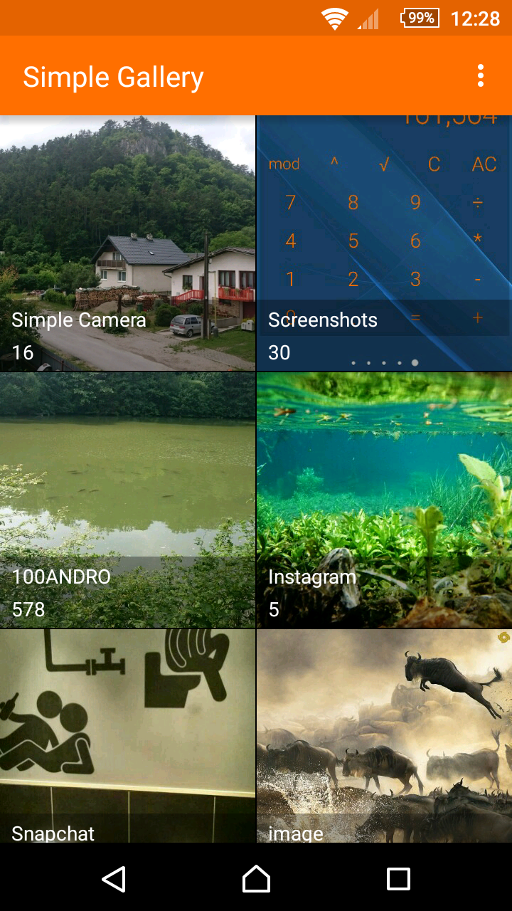
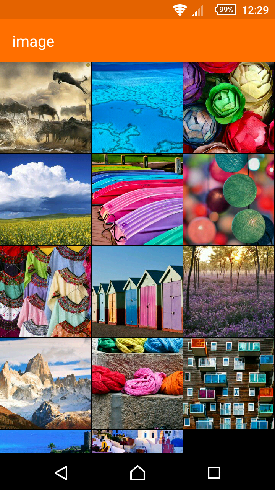

# Simple Gallery

A gallery for viewing photos.

Albums are sorted by the modified time of the last item in them from the latest to oldest. Photos can be previewed in multiple columns depending on the size of the display and portrait/landscape mode. They can be renamed, shared or deleted. 

Does not support videos yet.

License
-------
    Copyright 2016 SimpleMobileTools
    
    Licensed under the Apache License, Version 2.0 (the "License");
    you may not use this file except in compliance with the License.
    You may obtain a copy of the License at
    
       http://www.apache.org/licenses/LICENSE-2.0
    
    Unless required by applicable law or agreed to in writing, software
    distributed under the License is distributed on an "AS IS" BASIS,
    WITHOUT WARRANTIES OR CONDITIONS OF ANY KIND, either express or implied.
    See the License for the specific language governing permissions and
    limitations under the License.
