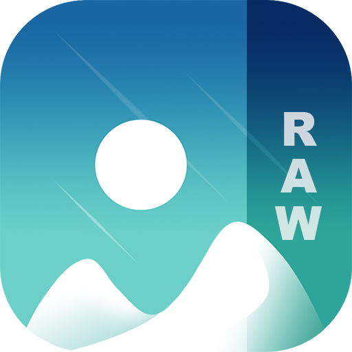

# GalleryRAW

GalleryRAW brings you all the photo viewing and editing features you have been missing on your Android in one stylish easy-to-use app. Browse, manage, crop and edit photos or videos faster than ever, recover accidentally deleted files or create hidden galleries for your most precious images and videos. And with advanced file-support and full customization, finally, your gallery works just the way you want.

ADVANCED PHOTO EDITOR  
Turn photo editing into child's play with GalleryRAW's improved file organizer and photo album. Intuitive gestures make it super easy to edit your images on the fly. Crop, flip, rotate and resize pictures or apply stylish filters to make them pop in an instant.

ALL THE FILES YOU NEED  
GalleryRAW supports a huge variety of different file types including JPEG, PNG, MP4, MKV, RAW, SVG, GIF, Panoramic photos, videos and many more, so you enjoy full flexibility in your choice of format. Ever wonder "Can I use this format on my Android"? Now the answer is yes.

MAKE IT YOURS  
GalleryRAW's highly customizable design allows you make the photo app look, feel and work just the way you want it to. From the UI to the function buttons on the bottom toolbar, GalleryRAW gives you the creative freedom you need in a gallery app.

RECOVER DELETED PHOTOS & VIDEOS  
Never worry about accidentally deleting that one precious photo or video you just can't replace. GalleryRAW allows you to quickly recover any deleted photo and videos, meaning on top of being the best media gallery for Android, GalleryRAW doubles as an amazing photo vault app.

PROTECT YOUR PRIVATE PHOTOS, VIDEOS & FILES  
Rest assured your photo album is safe. With GalleryRAW's superior security features you can use a pin, pattern or your device’s fingerprint scanner to limit who can view or edit selected photos and videos or access important files. You can even protect the app itself or place locks on specific functions of the file organizer.

Check out the our site here:  
https://gallery-raw.webflow.io/

Reddit:  
https://www.reddit.com/r/GalleryRAW

Telegram:  
https://t.me/GalleryRAW

