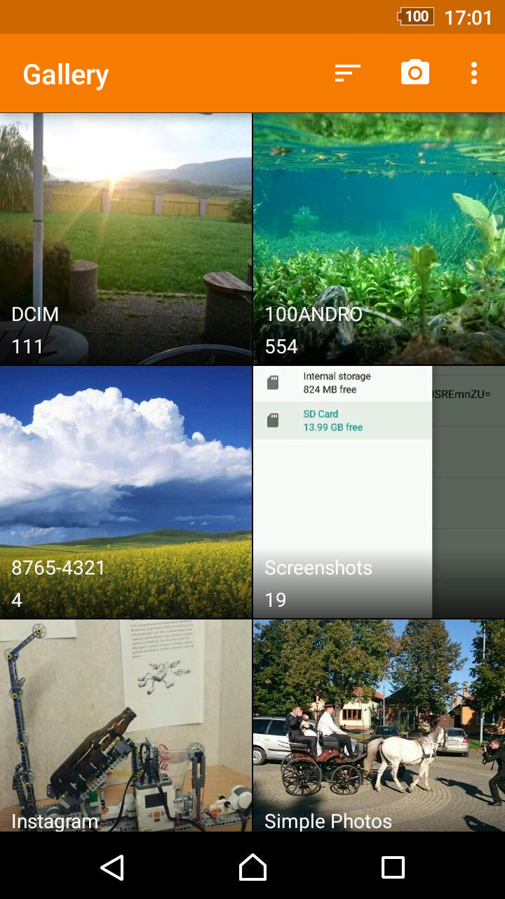
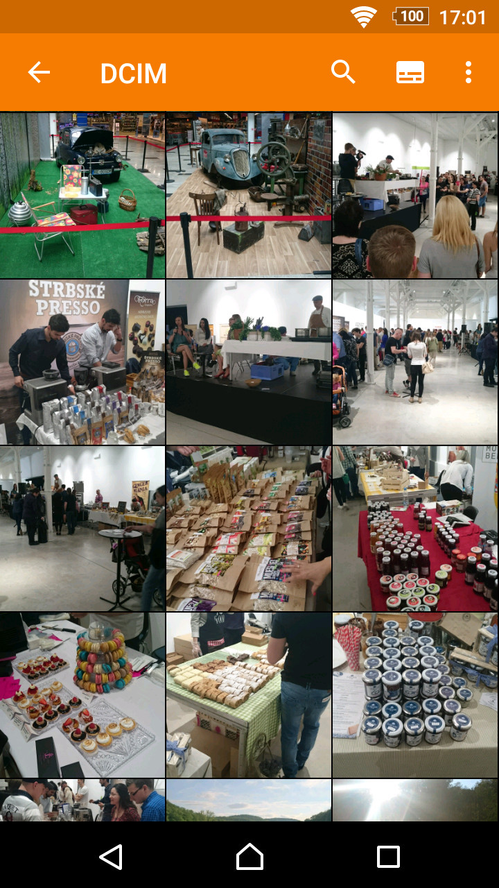

# Simple Gallery

A gallery for viewing photos and videos.

A highly customizable gallery capable of displaying many different image and video types including SVGs, RAWs, panoramic photos and videos.

It is open source, contains no ads or unnecessary permissions.

Let's list some of its features worth mentioning:
1. Search
2. Slideshow
3. Notch support
4. Pinning folders to the top
5. Filtering media files by type
6. Recycle bin for easy file recovery
7. Fullscreen view orientation locking
8. Marking favorite files for easy access
9. Quick fullscreen media closing with down gesture
10. An editor for modifying images and applying filters
11. Password protection for protecting hidden items or the whole app
12. Changing the thumbnail column count with gestures or menu buttons
13. Customizable bottom actions at the fullscreen view for quick access
14. Showing extended details over fullscreen media with desired file properties
15. Several different ways of sorting or grouping items, both ascending and descending
16. Hiding folders (affects other apps too), excluding folders (affects only Simple Gallery)

The fingerprint permission is needed for locking either hidden item visibility, the whole app, or protecting files from being deleted.

This app is just one piece of a bigger series of apps. You can find the rest of them at https://www.simplemobiletools.com

License
-------
    Copyright 2016-present SimpleMobileTools
    
    Licensed under the Apache License, Version 2.0 (the "License");
    you may not use this file except in compliance with the License.
    You may obtain a copy of the License at
    
       https://www.apache.org/licenses/LICENSE-2.0
    
    Unless required by applicable law or agreed to in writing, software
    distributed under the License is distributed on an "AS IS" BASIS,
    WITHOUT WARRANTIES OR CONDITIONS OF ANY KIND, either express or implied.
    See the License for the specific language governing permissions and
    limitations under the License.
