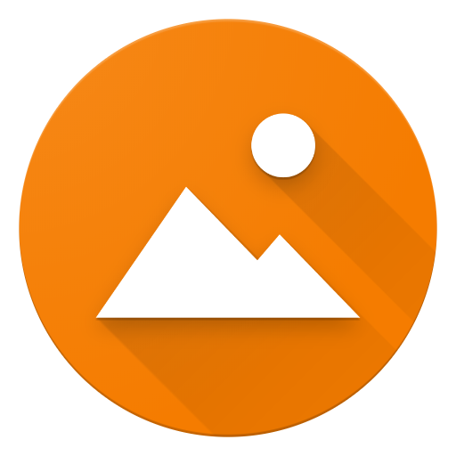

# Simple Gallery

Simple Gallery Pro is a highly customizable lightweight gallery loved by millions of people for its great user experience. Organize and edit your photos, recover deleted files with the recycle bin, protect & hide files and easily view a huge variety of different photo and video formats including RAW, SVG, GIF, panoramic and much more.

-------------------------------------------------
SIMPLE GALLERY PRO – FEATURES
-------------------------------------------------

• A beautiful modern gallery with no ads or popups

• Photo editor – crop, rotate, resize, draw, filters & more

• No internet access needed, giving you more privacy, security and stability

• No unnecessary permissions required

• Quickly search images, videos & other files

• Open and view many different photo and video types (RAW, SVG, panoramic, GIF etc)

• A variety of intuitive gestures to easily edit, rotate & organize files

• Lots of ways to filter, group and sort files

• Customize the appearance of Simple Gallery Pro

• Available in over 30 languages

• Mark files as favorites for quick access

• Protect your photos & videos with a pattern, pin or fingerprint

• Use pin, pattern & fingerprint to protect the app launch or specific functions too

• Recover deleted photos & videos from the recycle bin

• Toggle visibility of files to hide photos & videos

• Create a customizable slideshow of your files with many options

• View detailed information of your files (resolution, EXIF values etc)

• Zoom high quality photos, videos and GIFs easily with gestures

• Easily force portrait or landscape orientation for easy video viewing

• Quick file share to social media, email or anywhere else

• Print images or set them as wallpaper with a few clicks

• Create home screen shortcuts or widgets to easily access any file or folder

• Show the image location on a map, if available

• Obvious presence of standard operations like rename, copy/move, un/hide, delete

• Rewind videos with horizontal gestures

• Change photo and video brightness, or volume with vertical gestures

• Reorder, lock folders or change cover thumbnails anytime

• Set any image as wallpaper without hassle

… and much much more!

ADVANCED PHOTO EDITOR
Simple Gallery Pro makes it easy to edit your pictures on the fly. Crop, flip, rotate and resize your pictures. If you’re feeling a little more creative you can add filters and draw on your pictures!

SUPPORT FOR MANY FILE TYPES
Simple Gallery Pro supports a huge range of different file types including JPEG, PNG, MP4, MKV, RAW, SVG, GIF Panoramic photos, Panoramic videos and many more.

HIGHLY CUSTOMIZABLE FILE MANAGER
From the UI to the function buttons on the bottom toolbar, Simple Gallery Pro is highly customizable and works the way you want it to. No other gallery has this kind of flexibility! Thanks to being open source, we’re also available in over 30 languages!

RECOVER DELETED PHOTOS & VIDEOS
Accidentally deleted a precious photo or video? Don’t worry! Simple Gallery Pro features a handy recycle bin where you can recover deleted photos & videos easily.

PROTECT & HIDE PHOTOS, VIDEOS & FILES
Using pin, pattern or your device’s fingerprint scanner you can protect and hide photos, videos & entire albums. You can protect the app itself or place locks on specific functions of the app. For example, you can’t delete a file without a fingerprint scan, helping to protect your files from accidental deletion.

Check out the full suite of Simple Tools here:
https://www.simplemobiletools.com

Standalone website of Simple Gallery Pro:
https://www.simplemobiletools.com/gallery

Facebook:
https://www.facebook.com/simplemobiletools

Reddit:
https://www.reddit.com/r/SimpleMobileTools

Don't forget that if you uninstall any paid app within 2 hours, you will automatically be refunded. If you want a refund anytime later, just contact us at hello@simplemobiletools.com and you will get it. That makes it easy to try it out :)

