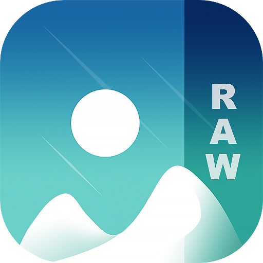

# Simple Gallery

Simple Gallery brings you all the photo viewing and editing features you have been missing on your Android in one stylish easy-to-use app. Browse, manage, crop and edit photos or videos faster than ever, recover accidentally deleted files or create hidden galleries for your most precious images and videos. And with advanced file-support and full customization, finally, your gallery works just the way you want.

ADVANCED PHOTO EDITOR  
Turn photo editing into child's play with Simple Gallery's improved file organizer and photo album. Intuitive gestures make it super easy to edit your images on the fly. Crop, flip, rotate and resize pictures or apply stylish filters to make them pop in an instant.

ALL THE FILES YOU NEED  
Simple Gallery supports a huge variety of different file types including JPEG, PNG, MP4, MKV, RAW, SVG, GIF, Panoramic photos, videos and many more, so you enjoy full flexibility in your choice of format. Ever wonder "Can I use this format on my Android"? Now the answer is yes.

MAKE IT YOURS  
Simple Gallery's highly customizable design allows you make the photo app look, feel and work just the way you want it to. From the UI to the function buttons on the bottom toolbar, Simple Gallery gives you the creative freedom you need in a gallery app.

RECOVER DELETED PHOTOS & VIDEOS  
Never worry about accidentally deleting that one precious photo or video you just can't replace. Simple Gallery allows you to quickly recover any deleted photo and videos, meaning on top of being the best media gallery for Android, Simple Gallery doubles as an amazing photo vault app.

PROTECT YOUR PRIVATE PHOTOS, VIDEOS & FILES  
Rest assured your photo album is safe. With Simple Gallery's superior security features you can use a pin, pattern or your device’s fingerprint scanner to limit who can view or edit selected photos and videos or access important files. You can even protect the app itself or place locks on specific functions of the file organizer.

<a href="https://f-droid.org/packages/com.simplemobiletools.gallery.pro">Get it on F-Droid</a>

Support us:  
IBAN: SK4083300000002000965231  
Bitcoin: 19Hc8A7sWGud8sP19VXDC5a5j28UyJfpyJ  
Ethereum: 0xB7a2DD6f2408Bce77334655CF5E7639aE31feb30  
Litecoin: LYACbHTKaM9ZubKQGxJ4NRyVy1gHUuztRP  
Bitcoin Cash: qz6dvmhq5vzkcsypxpp2mnur30muxdah4gvulx3y85  
Tether: 0x250f9cC32863E59b87037a14955Ed64F879653F0  
<a href="https://paypal.me/SimpleMobileTools?country.x=SK&locale.x=en_US">PayPal</a>  
<a href="https://www.patreon.com/tiborkaputa">Patreon</a>

